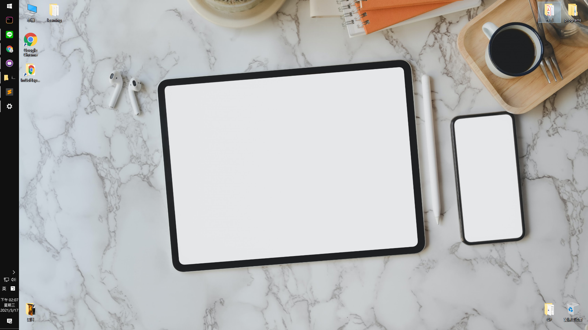
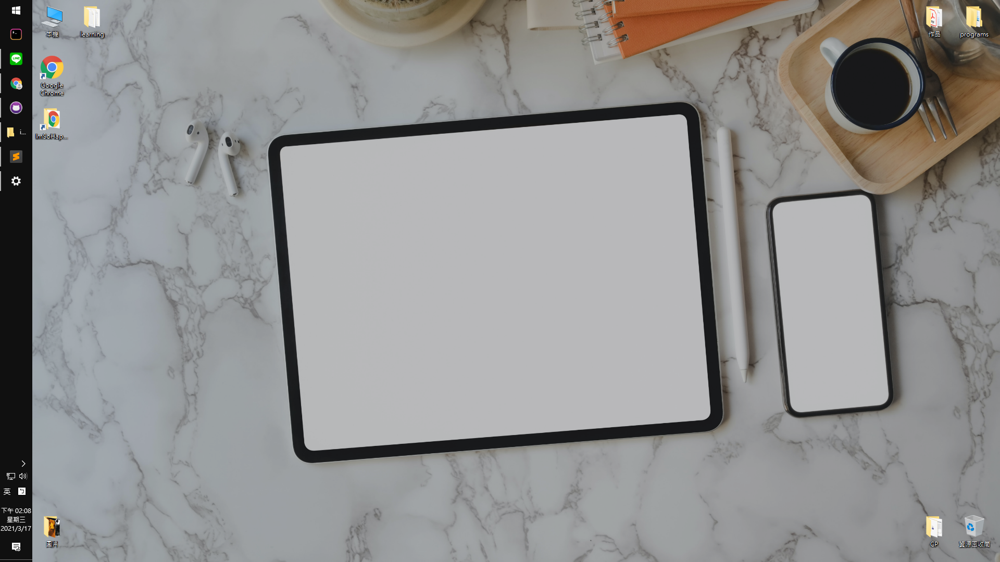
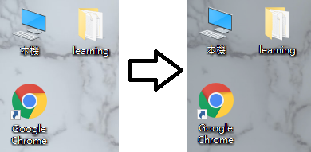

# Image Overlay

A simple application of image overlay (0.8 opacity black)  
This is useful for wallpapers, so you can view the icons more easily.  

# Online Demo

https://d1034181036.github.io/ImageOverlay/

# Example

### Before:  

### After:  

### Compare:  
